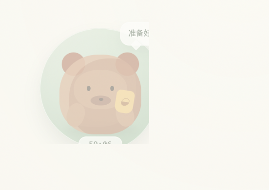

# 起身一下 · BreakPet

一个跨平台的桌面休息提醒工具，用一只可拖拽的悬浮宠物提醒你定时离开屏幕、喝水和走动。

BreakPet 适合长时间使用电脑的开发者、设计师、远程办公者和学生。它离线运行，不依赖远程服务，计时、宠物位置和外观设置都保存在本地。



## 功能

- 工作/休息计时，支持暂停、重置、立即休息和跳过
- 可选的全屏强制休息遮罩，帮助真正离开屏幕
- 独立的悬浮宠物窗口：可拖拽、置顶、调整大小和透明度
- 宠物位置、大小、透明度和提醒设置自动保存
- 颈部、肩背、腰背舒展动画，休息时自动轮播
- 今日完成次数和跳过记录
- 纯前端离线运行，使用 Tauri 打包为 macOS、Windows 和 Linux 桌面应用
- 开启“开机自动启动并计时”后，系统启动时会在后台恢复并继续工作倒计时

## 快速开始

需要 Node.js 18 或更高版本。

```bash
npm install
npm run dev
```

打开终端输出的本地地址即可预览。点击页面中的“快速体验”可以用短时长验证完整流程。

## 运行桌面应用

需要 Rust、系统 WebView 依赖和 Tauri CLI：

```bash
npm run tauri dev
```

关闭主窗口后，应用会收进系统托盘。启用悬浮宠物后，宠物会作为独立的无边框窗口显示在桌面上；按住宠物任意位置即可拖动，点击宠物可以重新打开控制面板。

在设置中开启“开机自动启动并计时”后，应用会随系统启动并自动开始工作计时，不需要再手动点击“开始这一轮”。手动打开桌面应用时仍由你决定何时开始。

## 构建安装包

```bash
npm run tauri build
```

Tauri 会在当前平台生成安装包。macOS、Windows 和 Linux 的构建需要分别在对应系统或 CI 环境中执行。发布 macOS 版本时，需要根据目标设备生成 Apple Silicon（aarch64）或 Intel（x86_64）安装包。

构建产物位于：

```text
src-tauri/target/release/bundle/
```

## 开发检查

```bash
npm test -- --run
npm run build
```

## 设计说明

休息动画是轻柔的活动示意，用于提醒用户改变姿势和短暂活动，不替代医疗或康复建议。动作提示参考 [NHS sitting exercises](https://www.nhs.uk/live-well/exercise/sitting-exercises/)。

悬浮宠物使用 Tauri 的透明窗口能力。当前桌面分发配置启用了 macOS 私有窗口 API；如果未来提交 Mac App Store，需要重新评估透明窗口实现和审核要求。

## License

Released under the [MIT License](LICENSE).

---

BreakPet is built for small, repeatable breaks: stand up, drink water, move a little, and come back refreshed.
